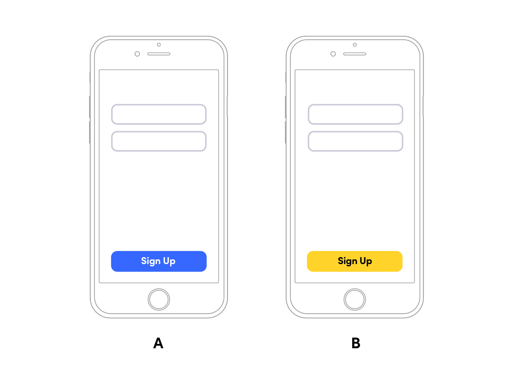
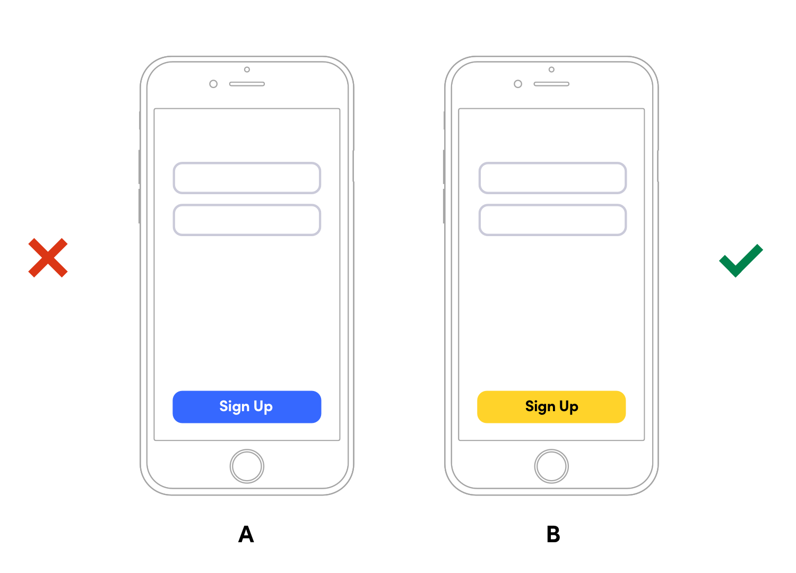

footer: @kylebshr
slidenumbers: true
theme: Lyft

[.slidenumbers: false]
[.hide-footer]

# How *(not)* to A/B Test
## Lessons learned @ Lyft
--
--
--
--
--
--
--
### @kylebshr • 27 March 2019

---

# What is an A/B Test?

^ You have an idea for an improvement, but you want to validate that it’s better in some measurable way

^ Useful for testing a hypothesis 

---



^ As a naive example, you want to test whether a yellow sign up button increases conversion

^ You’re testing experience (B) against a control, experience (A), hence the name

^ Now, I think a lot of people think you need to be able to dynamically insert code. But Swift is a compiled, static language.

---

## _In viewDidLoad..._

--
--
--

```ruby
FeatureFlag.yellowSignUpButton.on {
    button.setStyle(background: .yellow, text: .black)
} .off {
    button.setStyle(background: .blue, text: .white)
}
```

^ A/B test implementation usually looks something like this. 

---

# Monitor Results


^ Then you monitor the metrics...

---



^ And ship the more successful version!

^ Almost two years ago, decided to do something ambitious.. a huge a/b test.

---

# Lyft.app

^ Decided to a/b test a rewrite of the whole app

---

# Demand Graph Design
## Probably an improvement

Doesn’t __mean__ it will *move* metrics![^1]

[^1]: For more details on the citation guidelines of the American Psychological Association check out their [website](https://www.library.cornell.edu/research/citation/apa).

---

# Driver Home Redesign

- Does this thing
- Does that thing
- Here’s a longer thing it does

---

> You decided to do what with your a/b tests?
-- The Other Guy

—