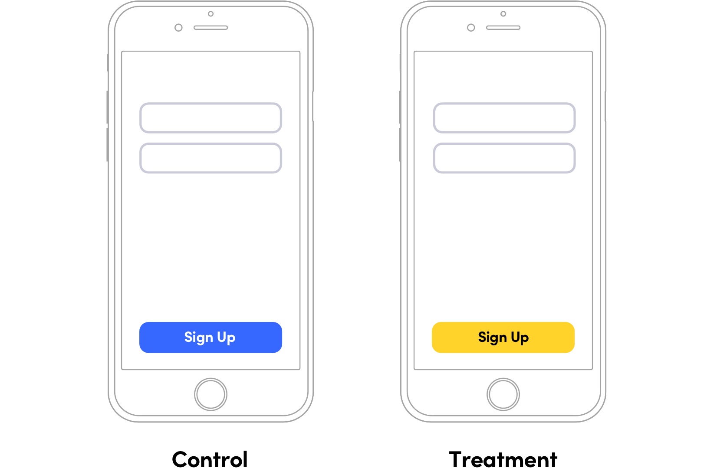
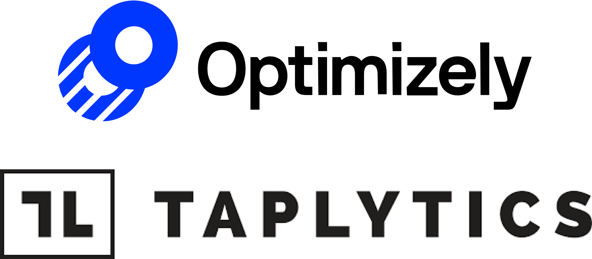

footer: @kylebshr
theme: Lyft
build-lists: true

[.slidenumbers: false]
[.hide-footer]

# **How *(not)* to A/B Test**
## Lessons learned in 
## experimentation at Lyft
--
--
--
--
--
--
### Kyle Bashour • @kylebshr • 27 March 2019

^ Welcome everyone, and thanks for coming to the Swift Language User group meetup. Thank you Noah for that excellent talk

^ My name is Kyle, and I’m an iOS developer here at Lyft on Driver Labs. I’ve been here over a year now, and I’m excited to talk about some of things I’ve learned about experimentation in that time. 

^ Questions at the end

---

# What is an A/B test?

^ A/B testing has become pretty commonplace over the last few years, but to make sure we’re on the same page let’s go over a quick example. 

^ You have an idea for an improvement, but you want to validate that it’s better in some measurable way

^ A/B testing lets you verify a hypothesis

^ randomly showing two experiences your users and using statistical analysis to determine which performs better

---

# Hypothesis


^ As a naive example, you want to test whether a yellow sign up button increases conversion

^ You’re testing experience (B) against a control, experience (A), hence the name

---

# Hypothesis



^ Other terms I might use: control, treatment

^ Now, I think a lot of people think you need to be able to dynamically insert code. That is, you modify the UI remotely, injecting a new experience.

^ But Swift is a compiled, static language - so let's take a look at what an A/B test looks like there.

---

## _In viewDidLoad..._
--
--
--
```ruby
FeatureFlag.yellowSignUpButton.on {
    button.setStyle(background: .yellow, text: .black)
} .off {
    button.setStyle(background: .blue, text: .white)
}
```

^ Now, these five lines of code might look simple, but there's a lot going on here, so let's go over it.

^ FeatureFlag is a class on which we define static instances. Provides two closures to call - one for when the experiment is on, one for when it's off.

^ That's how we implement our variation

^ But there's two other key requirements - assignment and exposure

^ Assignment happens on launch, when the config is downloaded. Tells the device which variant to use.

^ COMMON PITFALL is to consider this an exposure. 

^ However, if the user get's assigned the yellow sign up button, but never even got this far in the flow, it'll still impact metrics.

^ Now that we’ve created our variation, we ship our update and wait for results

^ After enough time, we’ll get statistically significant movements in our metrics

---

# Monitor Results


^ Thanks to an incredible experimentation team at Lyft, we have a dashboard for every experiment that looks something like this

^ Stat, change with conf. interval, chart to visualize the impact

^ who knew you could increase sign ups by 1.5% just by changing the button color!

---

# Ship It!


^ And ship the more successful version! 

^ All you have to do to clean it up is remove the flag & code in losing variant.

^ If you don't have the resources to build in house, several products

---

# A/B Testing Products
--


^ Whatever tools, monitor metrics...

^ If you don't have the resources to build in house, several products

^ Almost two years ago, decided to do something ambitious.. a huge a/b test.

---

# Lyft.app

^ Decided to a/b test a rewrite of the whole app

---

# Project X


^ Now this was a complete redesign, so we had a few goals

^ Wanted a completely fresh start, essentially a new app

^ also wanted to effortlessly clean up, but for an entire app

^ now you’re probably thinking, “no they didn’t...”

---

# Implementation


^ well, yes we did. We had not one, 

---

# Implementation


^ not two

---

# Implementation


^ but three app delegates. 

---

# Implementation


^ two of which led to entirely different apps

---

# Implementation


^ and one that implemented every single delegate method, and forwarded the calls to the correct delegate based on our feature flag

---

# Sidenote
--
--
--
```swift
@UIApplicationMain
class MyAppDelegate: UIResponder, 
    UIApplicationDelegate {...}
```

^ Now, there is another way to dynamically swap out your app delegate

^ Have you ever noticed the @UIApplicationMain attribute on your app delegate?

^ This is equivalent to calling a function of the same name

^ You can also add a main.swift (those of you who know obj. c might be familiar) and call this function yourself

--- 

# Sidenote

```swift
// main.swift

import UIKit

UIApplicationMain(
    CommandLine.argc,
    CommandLine.unsafeArgv,
    nil, // Or a UIApplication subclass
    NSStringFromClass(MyAppDelegate.self)
)
```

^ From the docs: 

^ - Instantiates the application object 
- Instantiates the delegate and sets it for the application. 
- Sets up the main event loop, including the application’s run loop, and begins processing events
- Loads the main nib file if there is one

^ You can implement your own main.swift, and check a flag

---

# Implementation


^ We had some bootstrapping to do after the app starts, so this approach didn't work

^ but our triple-appdelegate methods worked fine

^ now, this was actually a pretty neat idea

^ Could iterate on new stuff without worry about inter-op or breaking the old app

^ Still in the same project, even shared modules

^ And after a ton of incredible work, it was time to run the experiment

---

# Results


^ And the results looked something like this

^ some metrics were up, but some were down quite a bit

^ and realized downsides...

---

# What’s broken?
# **And why?**

^ With so many changes in a single a/b test, it’s often difficult to tell _why_ a metric moved a certain way

^ is it less intuitive? Is a specific button placement hurting conversion? Maybe the fact that we changed the order you do things?

^ one result of the decline in certain metrics meant we were testing this for a long time - over a year

^ this led to the second downside

---

# It’s hard to maintain 
# two apps

^ have to either build for future or current users, or sometimes twice

^ Applies to any extremely large change, doesn’t have to be as extreme as the whole app

^ So, clearly an A/B test can be too big.

---


^ good news, our strategy of easily deleting a variation worked

---

# Demand Graph Redesign


^ Switch gears to driver app

^ More similar to our log in button example.

^ Recently released new feature to show passenger demand.

^ Wanted to improve readability & design of graphs

---

# Implementation
--
--
```swift
protocol GraphDisplaying {...}

typealias GraphView = UIView & GraphDisplaying

class BarGraphView: UIView, GraphDisplaying {...}
``` 

^ Really into protocols at Lyft

^ From the beginning, was implemented with GraphDisplaying

^ protocols help with implementation

---

# Implementation

```swift
final class DemandGraphView: UIView {
    private let graphView: GraphView

    init(data: [Int]) {
        self.graphView = BarGraphView()
        self.graphView.display(data)
        super.init(frame: .zero)
    }
}
```

^ Notice that our property is the typealias, GraphView

^ Assign it an instance of BarGraphView

---

# Implementation
--
--
--
--
```swift
class InteractiveBarGraphView: UIView, 
    GraphDisplaying {...}
``` 

^ So, when time to add variation

---

# Implementation

```swift
init(data: [Int]) {
    if FeatureFlag.demandGraphV2.getValue() {
        self.graphView = InteractiveBarGraphView()
    } else {
        self.graphView = BarGraphView()
    }

    self.graphView.display(data)
    super.init(frame: .zero)
}
``` 

---

# Results


^ Nice and self contained

^ Didn’t get any useful results

^ Flat metrics don’t mean the experiment was bad

^ but looking back, it’s clear that an a/b test can be too small or subtle

^ If there’s a clear improvement that’s not changing much, sometimes not worth the time to test

---

# What does a good 
# A/B test look like?

^ Well designed A/B test is

^ Small enough to be fairly self-contained

^ Large enough change to merit testing

^ Has a hypothesis worth test

---

# Driver Home Redesign


^ Self contained, but also meaningful change

---

# Driver Home Redesign


---

# Implementation

```swift
private let newsFeedViewController =
    NewsfeedFeedViewController()

override func viewDidLoad() {
    self.setUpNewsFeedPanel()
}
```

^ One thing to keep in mind is that either variation could win

^ Want to make minimal changes to build your test, and ship quickly

^ Unlike graph, different API’s, each needs a different delegate

---

# Implementation

```swift
private lazy var newsFeedViewController =
    NewsfeedFeedViewController()

private lazy var incentivesViewController =
    IncentivesViewController()

override func viewDidLoad() {
    FeatureFlag.homeTabIncentives.on {
        self.setUpIncentivesPanel()
    } .off {
        self.setUpNewsFeedPanel()
    }
}
```

^ lazy vars make this nice

^ when you add the keyword lazy to a property, it's not instantiated until the property is accessed

^ Treatment is set up, other variation never instantiated

---

# Results


---

# Swift Recap

- Learned what `@UIApplicationMain` does
- Protocols can help with clean A/B structure
- In other cases, `lazy` instantiation can help

^ We learned how to a/b test an entire app, though I don't reccomend it

^ We saw how protocols can make it easier cleanly implement two variations

^ And in cases where that doesn't work well, lazy can help us out

---

# Final Thoughts

- Limit scope
- Solid hypothesis
- Build for shipping

^ But we also learned some important lessons about designing a/b tests

^ Limit scope so that your results are clean and relevant to what you're trying to test

^ Have an actual hypothesis to test, or your results won't have much meaning

^ Build for shipping to keep complexity down

---

# Thanks for listening!
## _Questions?_

---

-
