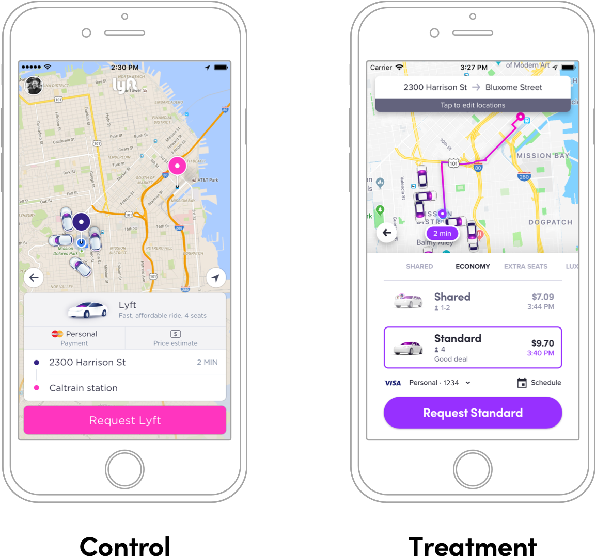

footer: @kylebshr
theme: Lyft

[.slidenumbers: false]
[.hide-footer]

# How *(not)* to A/B Test
## Lessons learned @ Lyft
--
--
--
--
--
--
--
### @kylebshr • 27 March 2019

---

# What is an A/B Test?

^ You have an idea for an improvement, but you want to validate that it’s better in some measurable way

^ Useful for testing a hypothesis 

---


^ As a naive example, you want to test whether a yellow sign up button increases conversion

^ You’re testing experience (B) against a control, experience (A), hence the name

^ Now, I think a lot of people think you need to be able to dynamically insert code. But Swift is a compiled, static language.

---

## _In viewDidLoad..._

--
--
--

```ruby
FeatureFlag.yellowSignUpButton.on {
    button.setStyle(background: .yellow, text: .black)
} .off {
    button.setStyle(background: .blue, text: .white)
}
```

^ A/B test implementation usually looks something like this. 

---

# Monitor Results


^ Then you monitor the metrics...

---


^ And ship the more successful version! 

^ All you have to do to clean it up is remove the flag & code in losing variant.

^ Almost two years ago, decided to do something ambitious.. a huge a/b test.

---

# Lyft.app

^ Decided to a/b test a rewrite of the whole app

---



^ Now this was a complete redesign, so we had a few goals

^ Wanted a completely fresh start, essentially a new app

^ also wanted to effortlessly clean up, but for an entire app

^ now you’re probably thinking, “no they didn’t...”

---


^ well, yes we did. We had not one, 

---


^ not two

---


^ but three app delegates. 

---


^ two of which led to entirely different apps

---


^ and one that implemented every single delegate method, and forwarded the calls to the correct delegate based on our feature flag

---

NEED CONTENT

^ now, this was actually a pretty neat idea

^ Could iterate on new stuff without worry about inter-op or breaking the old app

^ Still in the same project, even shared modules

---

NEED CONTENT

^ But then it came to time for the actual experiment

^ and realized downsides...

---

# What broke and why?

^ With so many changes in a single a/b test, it’s often difficult to tell _why_ a metric moved a certain way

^ is it less intuitive? Is a specific button placement hurting conversion? Maybe the fact that we changed the order you do things?

---

# It’s hard to maintain 
# two apps

^ one result of the decline in certain metrics meant we were testing this for a long time - nearly a year

^ have to either build for future or current users, or sometimes twice

^ Applies to any extremely large change, doesn’t have to be as extreme as the whole app

---


# Demand Graph Design
## Probably an improvement

Doesn’t __mean__ it will *move* metrics![^1]

[^1]: For more details on the citation guidelines of the American Psychological Association check out their [website](https://www.library.cornell.edu/research/citation/apa).

---

# Driver Home Redesign

- Does this thing
- Does that thing
- Here’s a longer thing it does

---

> You decided to do what with your a/b tests?
-- The Other Guy

—