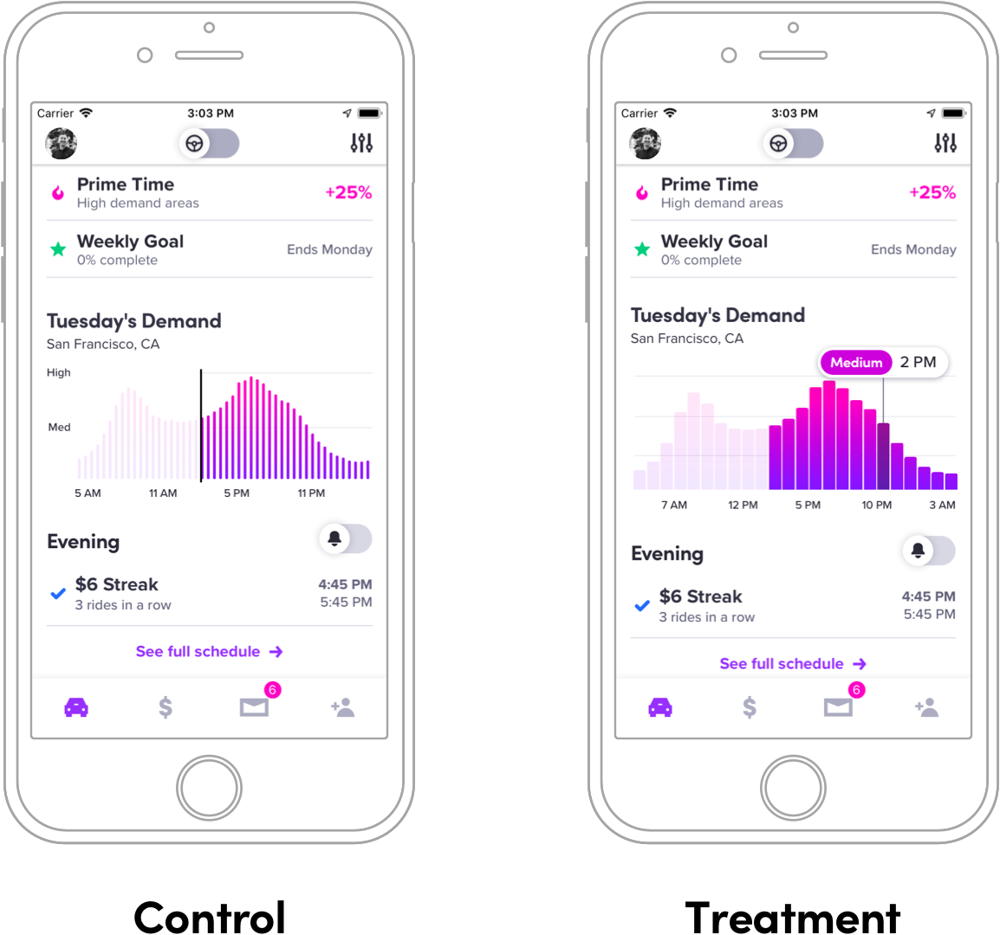

footer: @kylebshr
theme: Lyft

[.slidenumbers: false]
[.hide-footer]

# **How *(not)* to A/B Test**
## Lessons learned in 
## experimentation at Lyft
--
--
--
--
--
--
### Kyle Bashour • @kylebshr • 27 March 2019

^ Welcome everyone, and thanks for coming to the Swift Language User group

^ My name is Kyle, and I’m an iOS developer here at Lyft on Driver Labs. I’ve been here over a year now, and I’m excited to talk about some of the success and failures we’ve had in experimentation. 

---

# What is an A/B test?

^ A/B testing has become pretty commonplace over the last few years, but to make sure we’re on the same page let’s go over a quick example. 

^ You have an idea for an improvement, but you want to validate that it’s better in some measurable way

^ A/B testing lets you verify a hypothesis by randomly showing two experiences to a user, and using statistical analysis to determine which performs better

---

# Hypothesis


^ As a naive example, you want to test whether a yellow sign up button increases conversion

^ You’re testing experience (B) against a control, experience (A), hence the name

^ Now, I think a lot of people think you need to be able to dynamically insert code. But Swift is a compiled, static language - how do you modify that at runtime?

---

## _In viewDidLoad..._
--
--
--
```ruby
FeatureFlag.yellowSignUpButton.on {
    button.setStyle(background: .yellow, text: .black)
} .off {
    button.setStyle(background: .blue, text: .white)
}
```

^ May not have all the bells and whistles of dynamic language where we could do this on the fly

^ A/B test implementation is usually pretty simple looks something like this

^ Now that we’ve created our variation, we ship our update and wait for results

^ After enough time, we’ll get statistically significant movements in our metrics

---

# Monitor Results


^ Thanks to an incredible experimentation team at Lyft, we have a dashboard for every experiment that looks something like this

^ Stat, change with conf. interval, chart to visualize the impact

^ Then you monitor the metrics...

---

# Ship It!


^ And ship the more successful version! 

^ All you have to do to clean it up is remove the flag & code in losing variant.

^ Almost two years ago, decided to do something ambitious.. a huge a/b test.

---

# Lyft.app

^ Decided to a/b test a rewrite of the whole app

---

# Project X


^ Now this was a complete redesign, so we had a few goals

^ Wanted a completely fresh start, essentially a new app

^ also wanted to effortlessly clean up, but for an entire app

^ now you’re probably thinking, “no they didn’t...”

---

# Implementation


^ well, yes we did. We had not one, 

---

# Implementation


^ not two

---

# Implementation


^ but three app delegates. 

---

# Implementation


^ two of which led to entirely different apps

---

# Implementation


^ and one that implemented every single delegate method, and forwarded the calls to the correct delegate based on our feature flag

^ now, this was actually a pretty neat idea

^ Could iterate on new stuff without worry about inter-op or breaking the old app

^ Still in the same project, even shared modules

^ And after a ton of incredible work, it was time to run the experiment

---

# Results


^ And the results looked something like this

^ some metrics were up, but some were down quite a bit

^ and realized downsides...

---

# What’s broken?
# **And why?**

^ With so many changes in a single a/b test, it’s often difficult to tell _why_ a metric moved a certain way

^ is it less intuitive? Is a specific button placement hurting conversion? Maybe the fact that we changed the order you do things?

^ one result of the decline in certain metrics meant we were testing this for a long time - over a year

^ this led to the second downside

---

# It’s hard to maintain 
# two apps

^ have to either build for future or current users, or sometimes twice

^ Applies to any extremely large change, doesn’t have to be as extreme as the whole app

^ So, clearly an A/B test can be too big.

---


^ good news, our strategy of easily deleting a variation worked

---

# Demand Graph Redesign



^ Now, let’s switch gears and take a look at an experiment we recently ran in the driver app.

^ this one’s a little more similar to our log in button example.

^ Recently released new feature to show passenger demand.

^ Wanted to improve readability & design of graphs

---

# Implementation
--
--
```swift
protocol GraphDisplaying {...}

class BarGraphView: UIView, GraphDisplaying {...}           
``` 

^ protocols for graphs make a/b test nice

---

# Implementation
--
--
```swift
protocol GraphDisplaying {...}

class BarGraphView: UIView, GraphDisplaying {...}

class InteractiveBarGraphView: UIView, GraphDisplaying {...}

typealias GraphView = UIView & GraphDisplaying
``` 

---

# Implementation

```swift
final class DemandGraphView: UIView {
    private let graphView: GraphView

    init(frame: CGRect) {
        if FeatureFlag.demandGraphV2.getValue() {
            self.graphView = BarGraphView()
        } else {
            self.graphView = InteractiveBarGraphView()
        }

        ...

        self.graphView.display(data)
    }
}
``` 

---

# Results


^ Nice and self contained

^ Didn’t get any useful results

^ Flat metrics don’t mean the experiment was bad

^ but looking back, it’s clear that an a/b test can be too small or subtle

^ If there’s a clear improvement that’s not changing much, sometimes not worth the time to test

---

# What does a good 
# A/B test look like?

^ Well designed A/B test is

^ Small enough to be fairly self-contained

^ Large enough change to merit testing

^ Has a hypothesis worth test

---

# Driver Home Redesign


^ Self contained, but also meaningful change

---

# Driver Home Redesign


---

# Implementation

```swift
lazy var guidanceViewController = ...
lazy var newsFeedViewController = ...

override func viewDidLoad() {
    FeatureFlag.homeTabGuidance.on {
        self.setUpGuidancePanel()
    } .off {
        self.setUpNewsFeedPanel()
    }
    ...
}
```

^ lazy vars make this nice

---

# Results


---

# Final thoughts

---

# Thanks for listening!
## _Questions?_

---

-